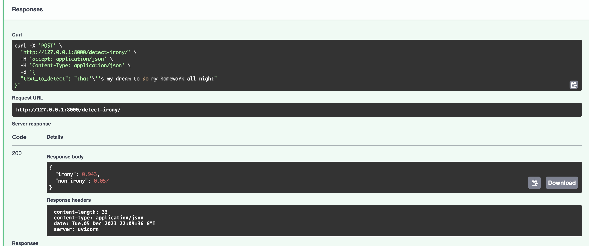
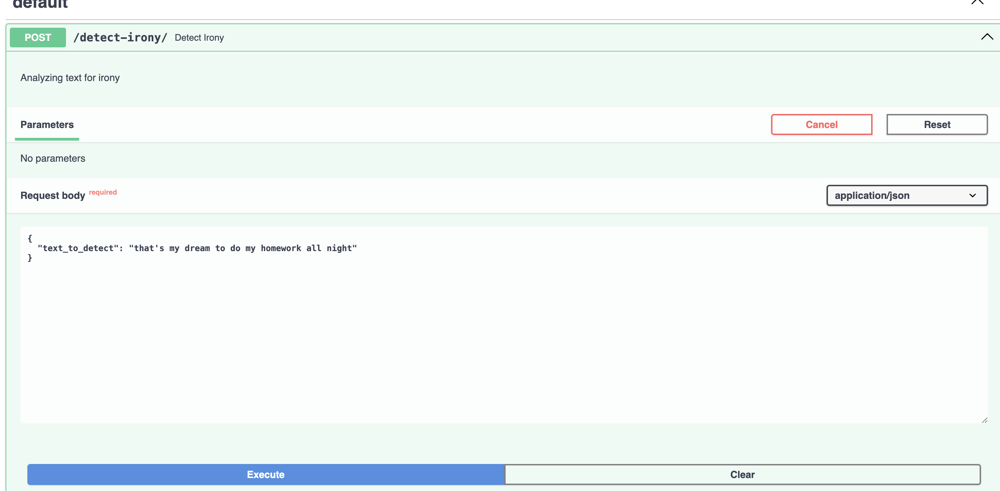

## WEB-клиент
### Для запуска:
```> streamlit run src/web/main.py```
### Пример работы:


## Web-API
### Endpoints:
 - "/detect-irony/" , 
    контракт:
     - request - { text_to_detect: "text bla bla" } 
     - response - { "non-irony": score, "irony": score }
 ### Примеры:
 
 

